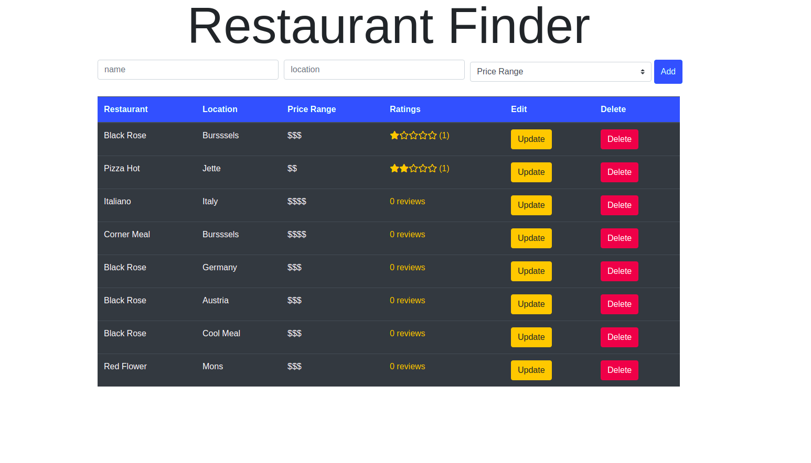

# Restaurants finder

> A full-stack app allows the user to find different resturants with different rating , it also allows th user to add , edit , delete and add a review and rating for a restaurant

## Table of contents

- [General info](#general-info)
- [Screenshots](#screenshots)
- [Technologies](#technologies)
- [Setup](#setup)
- [Features](#features)
- [Status](#status)
- [Inspiration](#inspiration)
- [Contact](#contact)

## General info

> A full-stack app resturants finder allows the user to easily find different resturants with review and rating

## Screenshots



## Technologies

- Node 14.16.0
- React 17.0.2
- Nodemon 2.0.7
- Express 4.17.1
- VSC code
- JavaScript
- Postman
- Heroku

## Setup

- `npm run start`

## Code Examples

```js
import React from "react";
import { BrowserRouter as Router, Switch, Route } from "react-router-dom";
import Home from "./routes/Home";
import UpdatePage from "./routes/UpdatePage";
import RestaurantDetailPage from "./routes/RestaurantDetailPage";
import { RestaurantsContextProvider } from "./context /RestaurantsContext";

const App = () => {
  return (
    <RestaurantsContextProvider>
      <div className="container">
        <Router>
          <Switch>
            <Route exact path="/" component={Home} />
            <Route
              exact
              path="/restaurants/:id/update"
              component={UpdatePage}
            />
            <Route
              exact
              path="/restaurants/:id"
              component={RestaurantDetailPage}
            />
          </Switch>
        </Router>
      </div>
    </RestaurantsContextProvider>
  );
};
export default App;
```

## Features

List of features ready and Todos for future development

-
-
-

To-do list:

-
-

## Status

Project is: _in progress_

## Inspiration

Resturants finder by freeCodeCamp.org

## Contact

By [HYF - Group 3]
